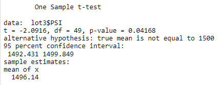

# MechaCar Statistical Analysis

## Resources
* R-Studio
* MechaCar_mpg.csv
* Suspension_Coil.csv

## Linear Regression to Predict MPG

* Each "Pr(>|t|)" value in the summary output indicates the likelihood that a given coefficient contributes randomly to the variance in the linear model. According to the results, vehicle length and ground clearance (and Intercept) provide a non-random amount of variance to the linear model of mpg. 

* According to the results, the multi linear model is: 
mpg = 6.27 * vehicle_length + 1.25e-3 * vehicle_weigth + 6.88e-2 * spoiler_angle -3.41 * AWD + 3.55 * ground_clearance - 1.04e+2 

  * Approximated to: 
  mpg = 6.27 * vehicle_length - 3.41 * AWD + 3.55 * ground_clearance - 104
  
  Which tells us that the slope of the linear model is not considered to be zero.

* 71% of the variations in mpg can be explained by the vehicle length, weight, spoiler angle, drivetrain and ground clearance, as indicated by an R-square value of 0.71. This makes the linear model for predicting MechaCar prototypes' mpg fairly efficient.

## Summary Statistics on Suspension Coils

The design specifications for the MechaCar suspension coils dictate that the variance of the suspension coils must not exceed 100 pounds per square inch. The design specs are shown with a global variance of 62.3 psi. On the lot summary data frame, Lot 1 and Lot 2 have variances of 0.98 and 7.5 psi. The Lot 3 is out of specs with a variance of 170.3 psi. 

All of the manufacturing lots: 
 

Per manufacturing lot: 

## T-Tests on Suspension Coils
### T-Test all manufacturing lots 
With a significance level of 0.06, our p-value of 0.069 is near the threshold. This means we don't have enough evidence to reject the null hypothesis, and we can conclude that the PSI in all manufacturing lots is comparable to the population mean of 1500 psi. 

### T-Tests per manufacturing lot
Lot 1 has the closest comparison to the population mean, with a p-value of 1.0. Lot 2 also shows strong comparability to the population mean, with a p-value of 0.61. On the other hand, Lot 3 did not show comparability to the population mean, having a p-value of 0.04. 

 
 
 

## Summary
## Study Design: MechaCar vs Competition

When evaluating MechaCar against its competitors, the following data analysis metrics would be relevant to consider:

* Time for MPH from x miles to y miles
* Highway MPG
* City MPG
* Safety rating
* Maintenance costs
* How long someone owns the vehicle

We can run different analysis from the data:
### Highway MPG will determine how long someone will own their vehicle.
* Null hypothesis: Highway mile per gallon does not effect how long someone owns a car.

### MechaCar has a higher safety rating than their competitors.
* Null hypothesis: MechaCar does not have a higher safety rating then their competitors.

To perform the test, we would need data of MechaCar vehicles and its competition, all gathered in a single dataframe where each metric is a column.

